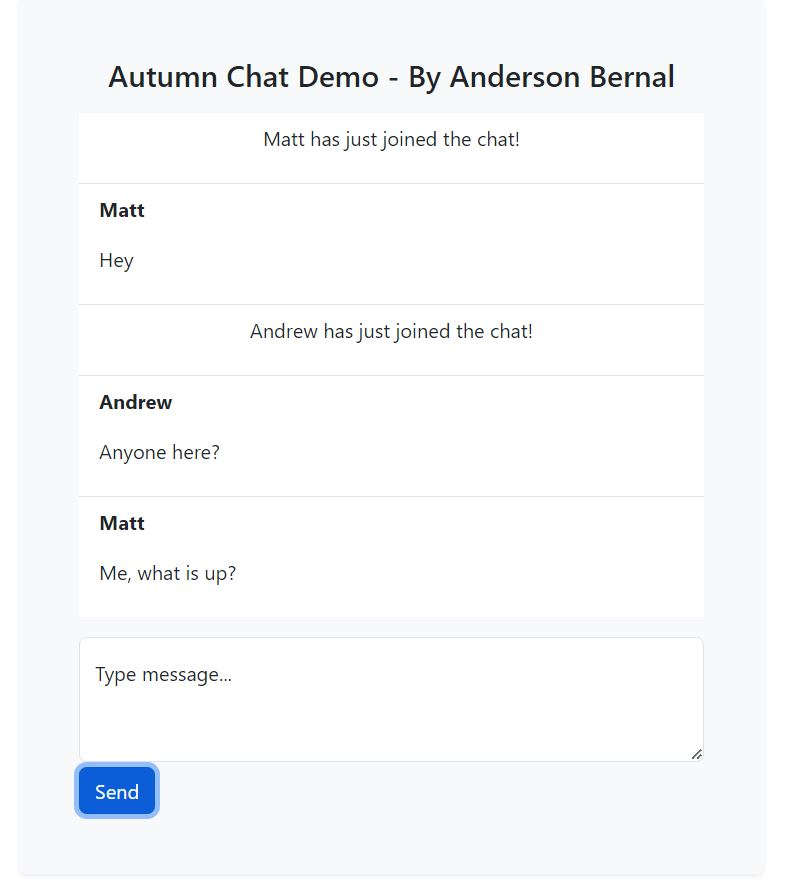

# Autumn Chat - A Real-Time Chat Application with Spring Boot

Autumn Chat is a real-time chat application developed with the Spring Boot framework. This application leverages WebSocket technology to enable users to chat in real-time within public chat rooms. The name "Autumn Chat" was chosen to convey the welcoming and friendly atmosphere of autumn, creating a virtual environment for communication.

## Preview



## Overview

Autumn Chat is a real-time chat platform offering the following features:

- **Real-Time Chat:** Users can connect and exchange messages in real time with other participants.

- **Public Chat Room:** All users can join the public chat room and engage in group conversations.

- **Custom Usernames:** Users can choose their own usernames when entering the chat room.

## Setup

To run the application, follow these steps:

1. Ensure you have the Java Development Kit (JDK) and Maven installed on your system.

2. Clone this repository or download the source code.

3. Navigate to the root directory of the application.

4. Run the following command to compile and start the server:

   ```bash
   mvn spring-boot:run
   ```

5. The server will be available at `http://localhost:8080`.

## How It Works

The `ChatController` is the heart of the application. It handles messages sent by users and broadcasts them to all participants in the public chat room. Here's a summary of how the controller works:

- **Message Sending:** When a user sends a message, the `sendMessage` method is invoked. It sends the message to the public chat room via the `/topic/public` topic.

- **User Addition:** When a new user enters the chat room, the `addUser` method is called. It sets the new participant's username in the session and notifies all other users about the new member's entry.

## Usage

Once the application is running, you can access the chat interface in your web browser. Use a username to identify yourself in the public chat room and start chatting in real time with other participants.

## Technologies Used

- Spring Boot: Java framework for web application development.

- WebSockets: Bidirectional real-time communication protocol.

## Contributions

If you wish to contribute to this project or report issues, feel free to open an issue or submit a pull request.

## License

This project is distributed under the MIT License. Refer to the [LICENSE](LICENSE) file for more details.

## Contact

If you have any questions or need support, please contact us via email at [andersonbernal2017@gmail.com].

Thank you for using Autumn Chat for your real-time communication needs! We hope you enjoy the friendly autumn experience while interacting with others.
